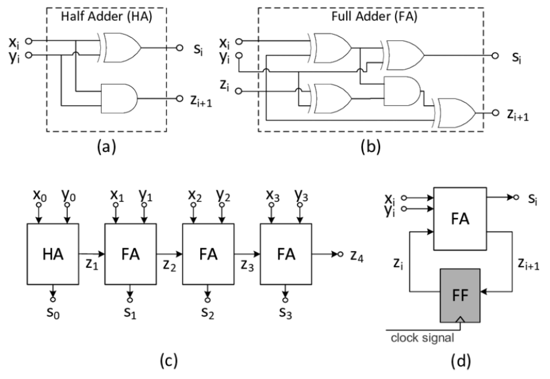
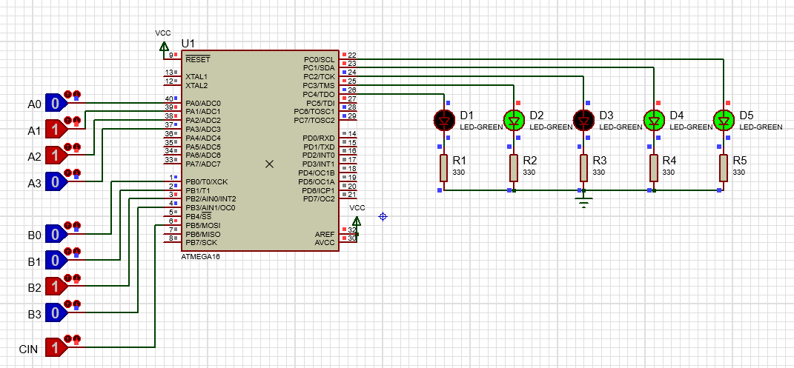
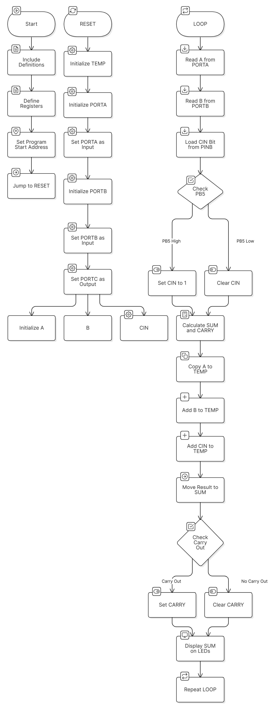
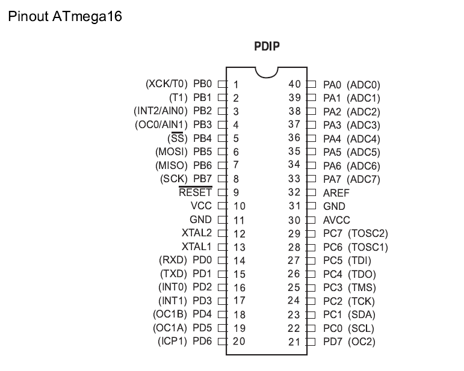

# 4-Bit Full Adder Using ATmega16

This project implements a **4-bit Full Adder** using the **ATmega16 microcontroller**. It computes the sum and carry-out for two 4-bit binary inputs along with a carry-in signal. The results are displayed using LEDs connected to the microcontroller.

---

## ✨ Features
- **4-bit Binary Addition**:
  - Adds two 4-bit numbers (A and B) with a carry-in (Cin).
  - Outputs the Sum and Carry-out (Cout) on LEDs.
- **Dynamic Input Handling**:
  - Reads inputs directly from PORTA, PORTB, and PINB.
- **Assembly Language Implementation**:
  - Efficient and optimized for microcontroller use.

---

## 📋 Table of Contents
1. [Overview](#overview)
2. [Requirements](#requirements)
3. [Setup Instructions](#setup-instructions)
4. [How It Works](#how-it-works)
5. [Project Diagrams](#project-diagrams)
6. [References](#references)
7. [License](#license)

---

## 🛠️ Requirements

### Hardware:
- **ATmega16 Microcontroller** //1MHz internal clock used here
- LEDs (5) with 330 Ω resistors
- Push buttons (for binary inputs)
- Breadboard and jumper wires
- 5V Power Supply

### Software:
- [AVR Studio](https://www.microchip.com/mplab/avr-support/atmel-studio-7) (for compiling the code)
- [Proteus](https://www.labcenter.com/) (for circuit simulation)
- [AVRDUDE](http://savannah.nongnu.org/projects/avrdude/) (for programming the microcontroller)

---

## 🚀 Setup Instructions

1. **Assemble the Circuit**:
   - Connect inputs (A, B, and Cin) to **PORTA**, **PORTB**, and **PINB**, respectively.
   - Connect outputs (Sum and Carry) to **PORTC**, where LEDs are attached.
   - Use pull-down resistors with input buttons for stable signals.

2. **Load the Assembly Code**:
   - Open `4bit_full_adder.asm` in AVR Studio.
   - Compile the file to generate the `.hex` file.

3. **Program the Microcontroller**:
   - Use a suitable programmer (e.g., USBasp) to flash the `.hex` file to the ATmega16.

4. **Run the Simulation**:
   - Simulate the circuit using Proteus to validate functionality.
   - Test the hardware circuit with various input combinations.

---

## ⚙️ How It Works

1. **Initialization**:
   - Input ports (PORTA and PORTB) are configured as inputs.
   - Output port (PORTC) is configured to drive LEDs.

2. **Input Handling**:
   - Binary values for A and B are read from PORTA and PORTB.
   - Cin is derived from the 5th bit of PINB (via `SBRC` and `SBRS` instructions).

3. **Calculation**:
   - A, B, and Cin are added using the `ADD` instruction.
   - Carry-out is detected using bitwise operations.

4. **Output Display**:
   - Sum and Carry-out values are written to PORTC, lighting up the corresponding LEDs.

---

## 📊 Project Diagrams

### Circuit Diagram
   - Example: A = 6 , B = 4, Cin = 1 (in decimal) || Sum = 11, Cout = 0 (in decimal)
  

### Flowchart

### Pinout Diagram

---

## 🔗 References
- [ATmega16 Datasheet](https://ww1.microchip.com/downloads/en/DeviceDoc/doc2466.pdf)
- [AVR Assembly Language Tutorial](https://www.avr-asm-tutorial.net/avr_en/)
- [Proteus Circuit Simulation Tool](https://www.labcenter.com/)

---

## 📝 License

This project is distributed under the MIT License. Feel free to use and modify it as needed.

Copyright (c) [2025] [Efe Varol Bedelcigil]

Permission is hereby granted, free of charge, to any person obtaining a copy of this software and associated documentation files (the "Software"), to deal in the Software without restriction, including without limitation the rights to use, copy, modify, merge, publish, distribute, sublicense, and/or sell copies of the Software, and to permit persons to whom the Software is furnished to do so, subject to the following conditions:

The above copyright notice and this permission notice shall be included in all copies or substantial portions of the Software.

THE SOFTWARE IS PROVIDED "AS IS", WITHOUT WARRANTY OF ANY KIND, EXPRESS OR IMPLIED, INCLUDING BUT NOT LIMITED TO THE WARRANTIES OF MERCHANTABILITY, FITNESS FOR A PARTICULAR PURPOSE AND NONINFRINGEMENT. IN NO EVENT SHALL THE AUTHORS OR COPYRIGHT HOLDERS BE LIABLE FOR ANY CLAIM, DAMAGES OR OTHER LIABILITY, WHETHER IN AN ACTION OF CONTRACT, TORT OR OTHERWISE, ARISING FROM, OUT OF OR IN CONNECTION WITH THE SOFTWARE OR THE USE OR OTHER DEALINGS IN THE SOFTWARE.

